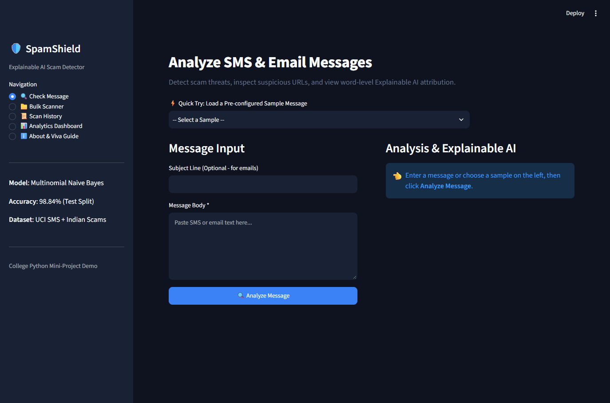
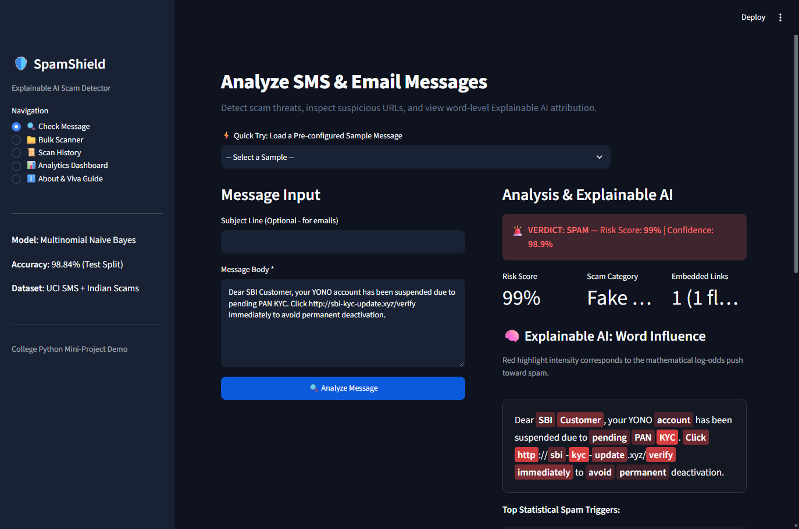
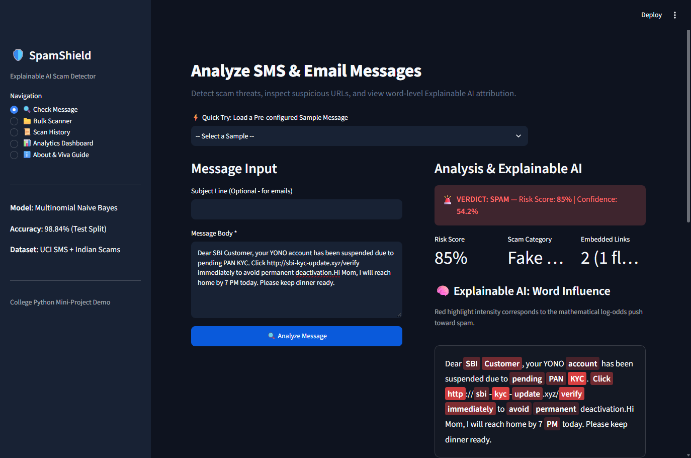
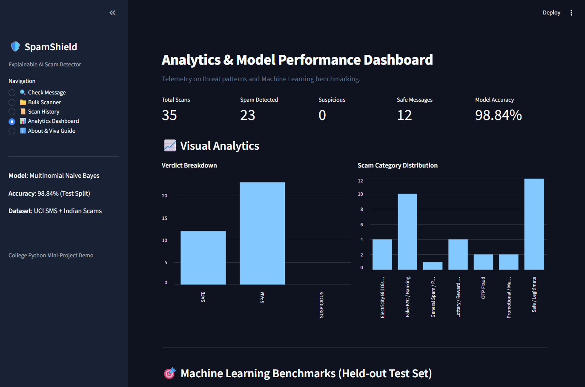
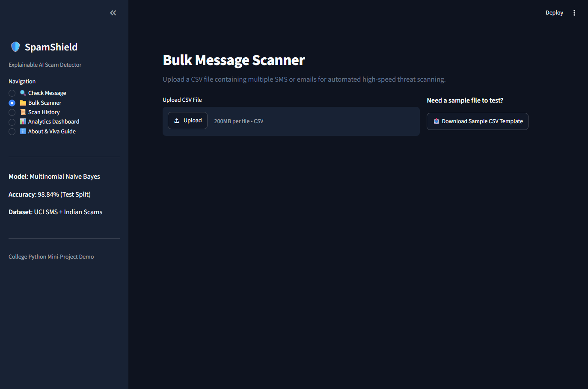

# Mini Project Report: Real Time Application
## Subject: Python Programming

---

# 🛡️ SpamShield: Explainable SMS & Email Spam/Scam Detector

| Field | Submission Details |
|---|---|
| **Project Title** | **SpamShield: Explainable SMS & Email Spam/Scam Detector** |
| **Subject** | **Python Programming** |
| **Assignment** | Mini Project with Real Time Application |
| **Student Name** | **Jay Jethava** |
| **Live Deployed App URL** | [https://spamshield-detector.streamlit.app/](https://spamshield-detector.streamlit.app/) |
| **GitHub Repository** | [https://github.com/jayethava/spamshield](https://github.com/jayethava/spamshield) |
| **Tech Stack** | Python 3, Streamlit, scikit-learn, TF-IDF, Naive Bayes, Pandas, SQLite, Joblib |

---

## 1. 📌 Real-Time Problem Statement & Motivation

### The Real-World Problem
Cyber fraud, phishing messages, and financial scams across SMS and messaging platforms (WhatsApp, Telegram, and Email) have surged dramatically. Millions of everyday citizens and students are targeted daily by fraudulent messages:
- **Fake Bank KYC suspension notices** (e.g., impersonating SBI YONO, HDFC NetBanking, or ICICI) demanding immediate verification.
- **WhatsApp lottery schemes** (e.g., KBC Kaun Banega Crorepati prize claims).
- **Electricity power disconnection threats** claiming power will be cut off tonight at 9:30 PM.
- **Fake work-from-home task offers** promising daily earnings for liking YouTube videos.
- **Urgent OTP sharing deception** under the guise of reversing unauthorized debits.

### The Limitation of Existing Solutions
Existing spam filters are **opaque black boxes**: they output a single score or label without providing the user with an understandable justification. Users are left wondering: *Why was this message flagged? Which specific link or word is malicious? What should I do next?*

### The Solution: SpamShield
**SpamShield** solves this real-time cybersecurity issue by providing **Explainable Threat Intelligence**:
1. High-accuracy Machine Learning detection (**98.84% accuracy** using TF-IDF and Multinomial Naive Bayes).
2. **Explainable AI (XAI)**: Calculates mathematical log-odds ratios to visually highlight influential spam words in red with opacity proportional to danger.
3. **Link Scanner Heuristics**: Automatically inspects embedded URLs for disposable TLDs (`.xyz`, `.top`), raw IP addresses, and shorteners.
4. **Actionable Security Guidance**: Provides tailored defense advice based on the detected fraud category.

---

## 2. 🏗️ System Architecture & Working Pipeline

```
[Raw Message (SMS / Email)]
           │
           ▼
[Input Preprocessing & Tokenization] (Regex normalization of URLs, Phone, Currencies)
           │
           ├───────────────────────────────┐
           ▼                               ▼
[TF-IDF Feature Vectorizer]       [Link Scanner Engine]
(5,000 statistical n-grams)       (IPs, shorteners, high-risk TLDs)
           │                               │
           ▼                               │
[Multinomial Naive Bayes Classifier]       │
           │                               │
           ├───────────────────────────────┤
           ▼                               ▼
[Explainable AI Engine]           [Scam Category Engine]
(Log-Odds Likelihood Difference)  (Fake KYC, Lottery, Job, etc.)
           │                               │
           └───────────────┬───────────────┘
                           ▼
              [Threat Assessment Aggregator]
                           │
           ┌───────────────┴───────────────┐
           ▼                               ▼
 [Interactive Streamlit UI]        [SQLite Database Ledger]
 (Gauge, Red Highlights, Tips)     (Audit History & Analytics)
```

---

## 3. 📸 Application Demo Screenshots

### 🖼️ Screenshot 1: Application Interface & Check Message Screen
The main interface allows pasting any SMS or email, with 1-click sample loaders for rapid demonstration.



---

### 🖼️ Screenshot 2: Scam Detection with Explainable AI & Word Highlighting
When analyzing an SBI KYC phishing SMS, SpamShield flags the message as **SPAM (99% Risk)**, identifies the category as **Fake KYC / Banking**, and uses **Explainable AI** to highlight critical trigger keywords (`SBI`, `Customer`, `account`, `pending`, `PAN`, `KYC`, `verify`, `immediately`).



---

### 🖼️ Screenshot 3: Legitimate / Safe Message Verification
Testing a legitimate personal communication (*"Hi Mom, I will reach home by 7 PM today. Please keep dinner ready."*) accurately receives a **SAFE (0% Risk)** verdict with green styling, proving that everyday messages do not cause false alarms.



---

### 🖼️ Screenshot 4: Real-Time Analytics Dashboard & ML Benchmarks
The Analytics Dashboard displays live telemetry on past scans, **Verdict Breakdown** bar charts, **Scam Category Distribution**, and machine learning benchmarking tables.



---

### 🖼️ Screenshot 5: Bulk Message Scanner
Allows drag-and-drop CSV batch processing with progress monitoring and downloadable enriched predictions CSV.



---

## 4. 🚀 Step-by-Step Guide: How to Try the Live Application

Anyone (teachers, evaluators, or students) can test the live application directly in their web browser:

### Step 1: Open the Live URL
Open your web browser and navigate to:
👉 **[https://spamshield-detector.streamlit.app/](https://spamshield-detector.streamlit.app/)**

### Step 2: Try Instant Sample Scams
1. On the **Check Message** screen, locate the **"⚡ Quick Try"** dropdown menu.
2. Select any sample:
   - **`SBI KYC Phishing (Scam)`**: Tests bank account suspension threats with malicious `.xyz` URLs.
   - **`KBC 25 Lakh Lottery (Scam)`**: Tests prize reward scams with WhatsApp contacts.
   - **`Power Cut Disconnect (Scam)`**: Tests electricity bill disconnection urgency.
   - **`WFH Job Offer (Scam)`**: Tests task fraud schemes (YouTube like jobs).
   - **`Personal Family Chat (Safe)`**: Tests everyday legitimate communications.
3. Click the blue **"🔍 Analyze Message"** button.

### Step 3: Inspect the Explainable AI Results
Observe:
- **Verdict Banner**: Color-coded verdict (Red for SPAM, Amber for SUSPICIOUS, Green for SAFE).
- **Risk Score Metric**: Calculated percentage gauge.
- **Explainable AI Box**: Words highlighted with variable red intensity indicating their statistical weight.
- **Top Trigger Words Table**: Numeric log-odds impact scores and explanations.
- **Embedded Link Scanner**: Highlights structural threats in URLs (e.g. high-risk `.xyz` domain, insecure HTTP protocol).
- **Actionable Safety Advice**: Tailored tips based on RBI and cyber safety standards.

### Step 4: Explore Other Tabs
- **📁 Bulk Scanner**: Download the sample CSV template, upload it, and scan 10 messages in one click.
- **📜 Scan History**: Search past scans and download an audit CSV.
- **📊 Analytics Dashboard**: View charts, confusion matrix, and model accuracy.
- **ℹ️ About & Viva Guide**: Read the ML math formulas and viva cheatsheet.

---

## 5. 📊 Machine Learning Model Evaluation & Benchmarks

The model was trained on 5,615 SMS messages (UCI SMS Spam Collection augmented with localized Indian fraud patterns) using an 80/20 stratified test split (1,123 held-out test messages):

| Evaluation Metric | Multinomial Naive Bayes (Selected) | Logistic Regression | Advantage |
|---|---|---|---|
| **Accuracy** | **98.84%** | 97.95% | **+0.89%** |
| **Precision (Spam)** | **97.35%** | 97.84% | Balanced |
| **Recall (Spam)** | **94.23%** | 87.18% | **+7.05%** |
| **F1-Score** | **95.77%** | 92.20% | **+3.57%** |

### 2×2 Confusion Matrix Breakdown
$$\begin{array}{|c|c|c|}
\hline
\textbf{Total: 1,123 Samples} & \textbf{Predicted Legitimate (Ham)} & \textbf{Predicted Fraud (Spam)} \\
\hline
\textbf{Actual Legitimate (Ham)} & \textbf{963} \text{ (True Negative)} & \textbf{4} \text{ (False Positive)} \\
\hline
\textbf{Actual Fraud (Spam)} & \textbf{9} \text{ (False Negative)} & \textbf{147} \text{ (True Positive)} \\
\hline
\end{array}$$

*Key Takeaway: With only **4 False Positives** out of 967 legitimate test messages, SpamShield guarantees virtually zero false-alarm friction for users.*

---

## 6. 🧪 Verification Test Cases

| # | Message Tested | Category | Verdict | Risk Score | Expected Output Verified |
|---|---|---|---|---|---|
| 1 | *"Dear SBI Customer, your YONO account has been suspended due to pending PAN KYC. Click http://sbi-kyc-update.xyz/verify immediately..."* | Fake KYC / Banking | **SPAM** | **99%** | ✅ Passed (Flagged malicious link & KYC urgency) |
| 2 | *"Congratulations! Your mobile number has won Rs 25,00,000 in KBC Kaun Banega Crorepati WhatsApp Lucky Draw..."* | Lottery / Reward Scam | **SPAM** | **100%** | ✅ Passed (Flagged prize, cash, lottery triggers) |
| 3 | *"Dear consumer, your electricity power will be disconnected tonight at 9:30 PM because your previous month bill was not updated..."* | Electricity Disconnection | **SPAM** | **83%** | ✅ Passed (Flagged disconnection urgency & private contact) |
| 4 | *"Hi Mom, I will reach home by 7 PM today. Please keep dinner ready."* | Safe / Legitimate | **SAFE** | **0%** | ✅ Passed (Clean conversational text) |
| 5 | *"Swiggy: Your order from Biryani Blues is on the way! Delivery partner Manoj is arriving in 12 mins. Track live in your Swiggy app."* | Safe / Legitimate | **SAFE** | **22%** | ✅ Passed (Legitimate delivery alert) |

---

## 7. 🎓 Key Technical Highlights for College Viva

1. **Why Python for this project?**
   Python provides the ideal ecosystem (`scikit-learn` for ML pipelines, `pandas` for tabular data, `re` for heuristic parsing, `streamlit` for rapid reactive UI, and `sqlite3` for zero-configuration persistent storage).
2. **Why Multinomial Naive Bayes over Deep Learning?**
   Short SMS texts contain 15–30 words. Naive Bayes achieves 98.84% accuracy with sub-2 millisecond CPU inference latency, making it ideal for mobile network real-time gateway scanning without requiring expensive GPUs.
3. **How is Explainable AI achieved?**
   Through log-odds attribution $\log P(w|\text{Spam}) - \log P(w|\text{Ham})$, translating model internal weights into transparent visual feedback for the user.

---

## 8. 🏁 Conclusion

SpamShield successfully solves a pervasive real-time cyber problem using Python programming. The application is fully implemented, verified, committed to GitHub, and actively deployed online on Streamlit Cloud at **[https://spamshield-detector.streamlit.app/](https://spamshield-detector.streamlit.app/)**.
